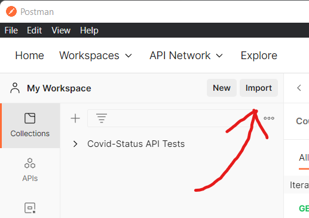
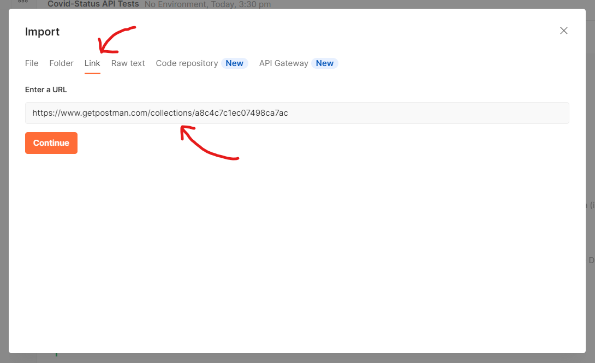
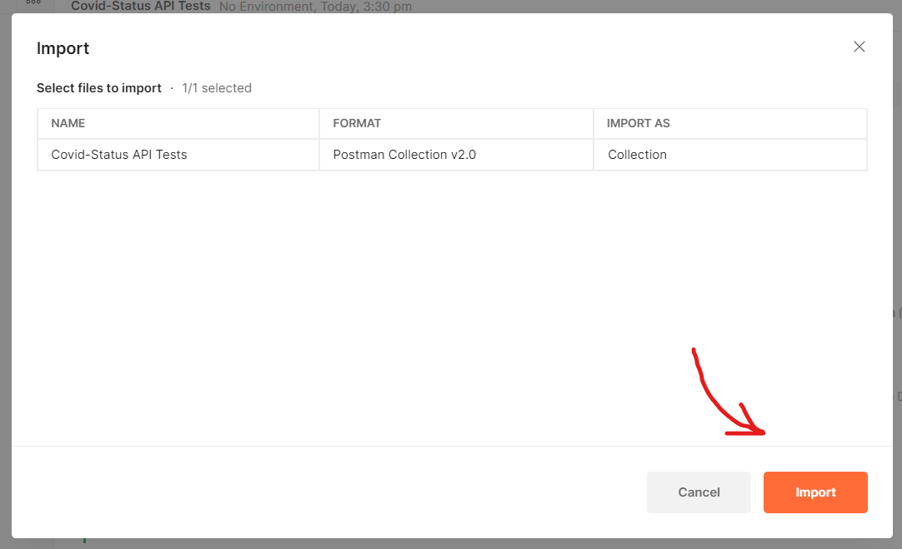

# Covid Cases Dummy API

## How To Build (2 Steps)
1. We can easily pull the image from the Docker Hub: ``` docker pull fammi/covid-status-api-crow ```
2. Create the container without specific settings needed:
```
- docker container create --name "CONTAINER_NAME" fammi/covid-status-api-crow:dummy
  
  or
  
 - docker container create --name "CONTAINER_NAME" --publish "PORT":18080 fammi/covid-status-api-crow:dummy
```
Now we can use the API locally.

## How To Use
The API specification is in here: [Covid Cases Dummy API Specification](https://fahmi-g.github.io/Covid-Cases-nodeflux/)

You can even use that for testing your API that you just built (The Covid Cases Dummy API). How cool!

## API Testing
If you are a Postman person and more prefer to use Postman, dont worry I got you.
Here is the link if you want to use my tests collection: [Postman Covid Cases Dummy API Tests Collection](https://www.getpostman.com/collections/a8c4c7c1ec07498ca7ac)

### How do i use that link?
1. Open Postman, in the left hand side you will see the collections tab. Then simply click Import.

2. Go to the link tab, and just paste the provided link there and click Continue.

3. And you just have to click Import and you are done. 

Now you can use and modify my test collection as you want.
