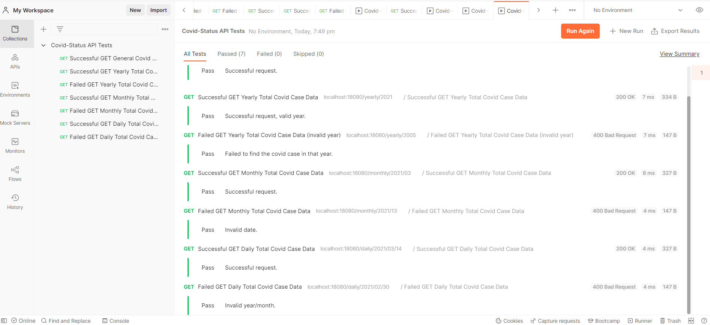
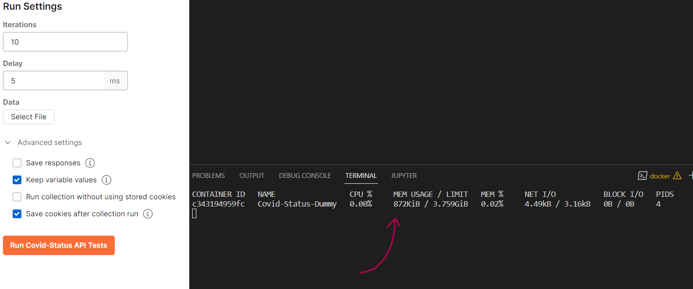
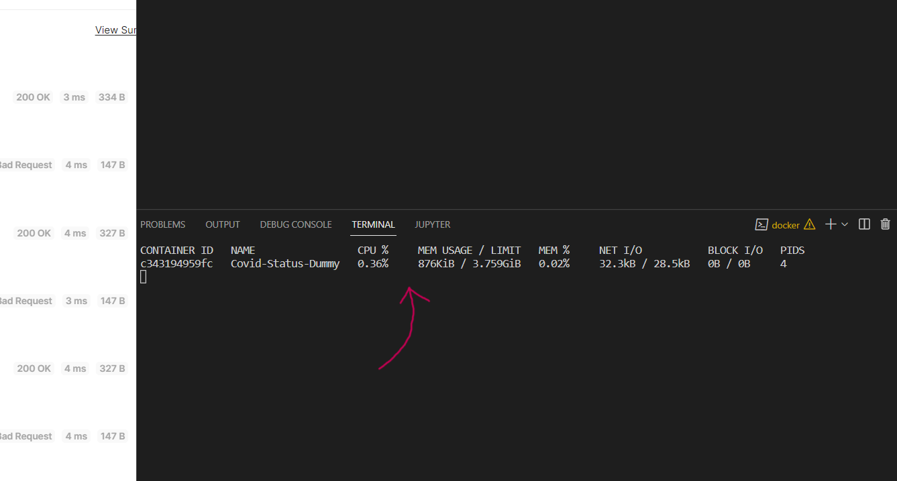
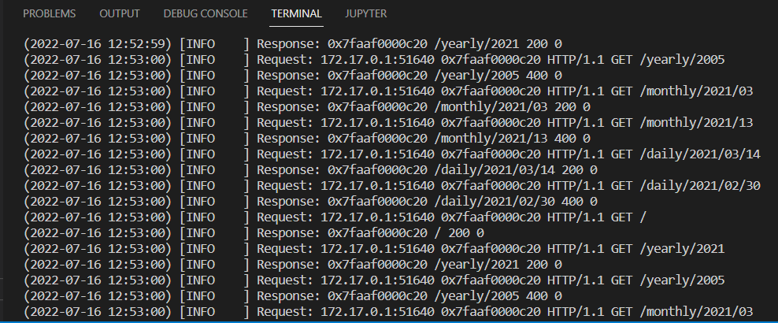

# Covid Cases Dummy API

## How To Build (2 Steps)
 1. We can easily pull the image from the Docker Hub: ``` docker pull fammi/covid-status-api-crow ```
 2. Create the container without specific settings needed:
    ```
    - docker container create --name "CONTAINER_NAME" fammi/covid-status-api-crow:dummy
      or
    - docker container create --name "CONTAINER_NAME" --publish "PORT":18080 fammi/covid-status-api-crow:dummy
    ```

## How To Use
- The API specification is in here: [Covid Cases Dummy API Specification](https://fahmi-g.github.io/Covid-Cases-nodeflux/)

  You can even use that for testing your API that you just built (The Covid Cases Dummy API). How cool!

## API Testing
  <ul><li> If you are a Postman person and more prefer to use Postman, dont worry I got you.
  Here is the link if you want to use our tests collection: [Postman Covid Cases Dummy API Tests Collection](https://www.getpostman.com/collections/a8c4c7c1ec07498ca7ac)</li>
  <ul><li></li></ul></ul>

#### How do i use that link?
   <ol><li> Open Postman, in the left hand side you will see the collections tab. Then simply click Import.</li>
   <ul><li></li></ul>
   <li> Go to the link tab, and just paste the provided link there and click Continue.</li>
   <ul><li></li></ul>
   <li> And you just have to click Import and you are done.</li>
   <ul><li></li></ul></ol>
    -  Now you can use and modify our test collection as you want.

## How The Backend Work
   <ul><li>Here is a simple picture of how the API operates in the backend.</li>
   <ul><li></li></ul></ul>

## API Performance
- Here are some picture of API performance/resource usage
  <ul><li>Idle API</li>
   <ul><li></li></ul></ul>
  <ul><li>With repetitive requests</li>
   <ul><li></li></ul></ul>
   
- Logs
  <ul><li>Healty logs, no error</li>
   <ul><li></li></ul></ul>
